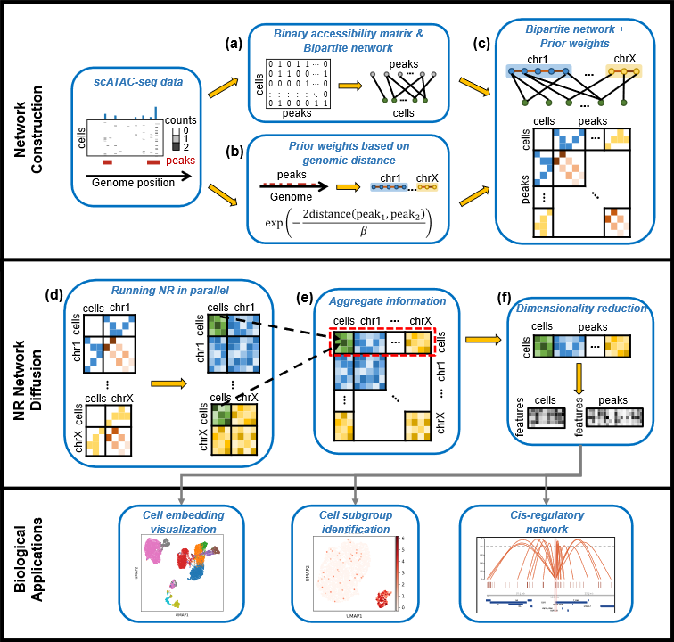

------------------------------------------------------------------------------------------------------
# SCARP method for scATAC-seq data analysis
Incorporating network diffusion and peak location information for better single-cell ATAC-seq data analysis


## Authors
- yujiating@amss.ac.cn
- lywu@amss.ac.cn

## Pipeline
<p align="center">
  <a href="https://github.com/Wu-Lab/SCARP/">
    
  </a>
</p>
<br />

## Installation

We recommend to create a new environment with Python 3.10:
```sh
conda create -n py310 python=3.10
conda activate py310
```
The `scarp` package can be installed via pip:

```sh
pip install scarp
```
#### Dependencies
[scanpy](https://scanpy.org/) (>=1.9.5)  
[numpy](https://numpy.org/) (>=1.25.2)  
[scipy](https://www.scipy.org/) (>=1.11.3)  
[pandas](https://pandas.pydata.org/) (>=2.1.1)  
<br />


## Usage

Please checkout the tutorials at
[here](https://github.com/Wu-Lab/SCARP/blob/master/Vignettes/Example.ipynb).

### 1. Preparing your scATAC-seq data in h5ad format
You can downloaded a example data from [here](https://github.com/Wu-Lab/SCARP/tree/master/Example_data/).
```sh
import scanpy as sc
```
```sh
data_name = 'Leukemia'
data = sc.read_h5ad('./Example_data/Leukemia.h5ad')
```

### 2. Running SCARP easily in one step

```sh
from scarp import model
```
```sh
Cells_df = model.SCARP(adata=data,
                       data_name=data_name,
                       plot_SD=True,
                       verbose=True
                       )
```

#### parameter descriptions:
 parameter name | description                                          | type           | default 
 :------------- | :--------------------------------------------------- | :------------- | :------ 
 adata          | input scATAC-seq data                                | h5ad           | None    
 data_name          | name of this dataset                                | str           | None    
 m              | parameter to control NR diffusion intensity                      | float          | 1.5     
 gamma     |  parameter to control the threshold for merging adjacent chromosomes            | int            | 3000    
 beta           | parameter to control the extent to which prior edge weight decays | int          | 5000     
 return_shape   | shape of the returned matrix                            | str            | 'CN'    
 peak_loc       | use peak location prior information or not                          | bool            | True    
 parallel       | parallel computing or not. 0 means automatically determined                         | int            | 0       
 plot_SD       | plot the SDs of PCs or not                        | bool            | True   
fig_size       | figure size of the SD plot                     | tuple            | (4,3)   
save_file       | if plot_std is True, the file path you want to save                  | str            | None
verbose       | print the process or not                  | bool            | True
<br />

### 3. Or you can run SCARP step by step
#### (1) Obtaining the NR diffused matrix
```sh
t, diffusion_mat = model.SCARP_diffusion_mat(adata=data)
```
#### (2) Computing the retained dimension
```sh
k = model.SCARP_SD_plot(data=diffusion_mat,
                        peaks_num=Peaks_num,
                        title=data_name,
                        plot_SD=True)
```
#### (3) Dimensional reduction
```sh
Cell_embedding = model.SCARP_cell_embedding(diffusion_mat=diffusion_mat,
                                            kept_comp=k)
```
## Reproduce results
For reproducibility, we provide all the necessary scripts and data [here](https://github.com/Wu-Lab/SCARP-reproduce).
